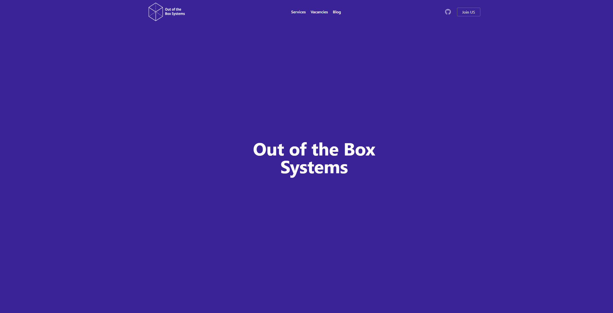

[](https://github.com/emersion/stability-badges#experimental)
	
# Site company "Out of the Box"

The *Out of the Box Systems* website is a Rust-focused company. Specializing in Rust development, the company emphasizes *trust*, *reliability*, and *flexibility*. The website showcases the company's services, job opportunities, and a Rust-centric blog, reflecting its commitment to *learning* and *knowledge sharing* within the tech community.

## To Run The project
 
 1. **[Install nvm tool.](https://github.com/coreybutler/nvm-windows/releases)**

2. **Check the nvm version to verify correct installation</br>**
```bash 
nvm --version
```
3. **Install Node**

```bash
# the latest version of Node
nvm install node
# Install the Node version using nvm.
nvm install 14.21.2 
# switches to using Node.js version 14.21.2
nvm use 14.21.2 
# Check the nvm version to verify correct installation version of Node.js
node -v 
```

2. **Set dependencies and run the project for debugging**.

```bash			
npm install
				
gulp watch 
```


